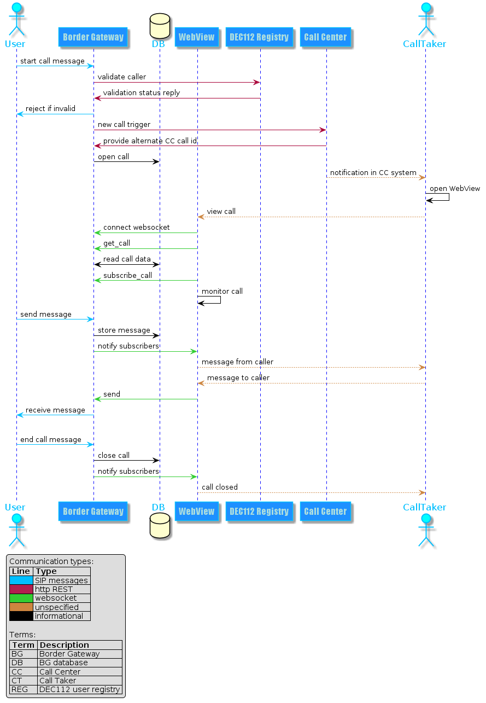

# DEC112 Border Gateway API description

The border gateway API is accessible via two technologies: **REST** and **Websocket**. Both technologies provide (almost) the same functionalities using the same method calls. The Websocket API provides an event mechanism which allows clients to be actively notified by border gateway about new calls or messages.



## Common objects

Some objects are common for multiple api methods and are described below.

### Timestamps
All timestamps used in API messages are in the form "yyyy-mm-ddTHH:MM:SS.ssZ" where
`y`=year, `m`=month, `d`=day, `M`=minutes, `S`=seconds, `s`=milliseconds. Time is always UTC and should be converted to local client time for display.

### request/response
Base structure of JSON message Api call is as follows:

Request:
```json
{
  "method": "api method to call",
  "xyz": "additional arguments"
}
```
The server respondes with the following base structure:

Response:
```json
{
  "code": "result code",
  "runtime_ms": "runtime in ms"
}
```

`runtime_ms` is the runtime of the call to complete in milliseconds - only available if server runns in debug mode.

### Call
A call is always provided in the following structure and is either identified by its `call_id` (generated by dec112) or its `call_id_alt` (provided via customer trigger or null).

### Message
A message is part of a call received from the caller and contains text, location and data portions.
`received_ts` a timestamp when this message was received by the dec112 border gateway.
`texts` is an array of strings with 0 or more entries.
`locations` an array of location objects each with `lat` (latitude) and `lon` properties (in WGS84 degrees). It can contain 0 or more entries.
`data` an array of arbitrary json objets not further specified with 0 or more entries.

```json
{
  "received_ts": "2018-04-27T09:50:54.282Z",
  "texts": [],
  "locations": [
    {
      "lat": 48.227121736854315,
      "lon": 16.346366358920932
    }
  ],
  "data": []
}
```

## Errors
In case of an error the response is:
```json
{
  "message": "error message",
  "code": "result code"
}
```
`code` is either 4xx or 5xx and `message` contains the error. If server runs in debug mode `message` contains the full runtime error message (if available). Otherwise only basic informations are provided in `message`.


## Events
The border gateway can notify clients about new calls or messages and call state changes. To be notified a client must first subscribe an event by one of the following methods.

* `subscribe_new_calls`
* `subscribe_new_message`
* `state_change`

The client then recceives one of this event notifications back:

### new_call
This message is sent to subscribers of this event when the border gateway receives a new call.

Event:
```json
{
  "event": "new_call",
  "created_ts": "2018-04-27T10:13:02.453Z",
  "call_id": 23,
  "call_id_alt": null,
  "caller_uri": "sip:a36e0d23777c09f1aabc26bccca48756@service.dec112.at",
  "code": 200
}
```

### new_message
This message is sent to subscribers of this event when a new message for an active call is received. This event is sent also when messages are sent from the border gateway using the `send` method (in which case the `origin` attribute has the value `local`).

Event:
```json
{
  "event": "new_message",
  "created_ts": "2018-04-27T09:47:56.772Z",
  "call_id": "22",
  "call_id_alt": null,
  "caller_uri": "sip:a36e0d23777c09f1aabc26bccca48756@service.dec112.at",
  "message": {
    "received_ts": "2018-04-27T09:50:54.282Z",
    "origin": "remote",
    "texts": ["This is a test message\r\n"],
    "locations": [
      {
        "lat": 48.227121736854315,
        "lon": 16.346366358920932
      }
    ],
    "data": []
  },
  "code": 200
}
```


### state_change
A `state_change` event is sent whenever the state of a call changes.
The following numerical value states are defined:

0. UNDEFINED
1. NEW_CALL
2. IN_CALL
3. STALE
4. CLOSED_BY_CALLER
5. CLOSED_BY_CENTER
6. CLOSED_BY_SYSTEM
7. ERROR

#### UNDEFINED
Should (and is) not be used.

#### NEW_CALL
Sent after received first message of a new call and after the `new_call` and `new_message` events.

#### IN_CALL
Sent when the second message of a call is received and after the `new_message` event.

#### STALE
A call enters this state after not receiving any messages for more than `sip.call_stale_timeout_ms` (configuration option).

#### CLOSED_BY_CALLER
Sent when caller ends call.

#### CLOSED_BY_CENTER
Sent when call center ends call

#### CLOSED_BY_SYSTEM
Sent when call enters `STALE` state and for not receiving any messages for more than `sip.call_close_timeout_ms` (configuration option)

Event:
```json
{
  "event": "state_change",
  "created_ts": "2018-04-27T10:13:02.453Z",
  "call_id": 23,
  "call_id_alt": null,
  "caller_uri": "sip:a36e0d23777c09f1aabc26bccca48756@service.dec112.at",
  "state": 2,
  "code": 200
}
```


## REST API
The rest API provides SWAGGER metadata (including the interactive SWAGGER UI) accessible via http://border-gateway-url/api-v1


## Websocket API
The websocket Api is reachable on the same base URL as the REST Api with
a 'ws' scheme e.g ws://localhost:8080/api/v1. It defines the 'dec112' websocket protocoll which must be provided when opening the socket.

The protocoll uses JSON messages as described in the following sections.

### Api methods
The action to perform is specified with the `method` property as described below. Optional the `tag` property can be specified with any arbitrary value to match request and response by the client.

#### get_active_calls
Returns the current active calls.

Request:
```json
{
  "method": "get_active_calls"
}
```
Response:
```json
{
  "method": "get_active_calls",
  "calls": [
    {
      "created_ts": "2018-04-27T10:13:02.453Z",
      "caller_uri": "sip:a36e0d23777c09f1aabc26bccca48756@service.dec112.at",
      "call_id": "23",
      "call_id_alt": null
    }
  ],
  "code": 200,
  "runtime_ms": "1.06438"
}
```

#### get_active_calls_count
Returns the number of current active calls.

Request:
```json
{
  "method": "get_active_calls_count"
}
```
Response example:
```json
{
  "method": "get_active_calls_count",
  "count": 1,
  "code":200,
  "runtime_ms": "0.38333"
}
```

#### get_call
Returns the call identified by `call_id`.

Request:
```json
{
  "method": "get_call",
  "call_id": "23"
}
```
Response example:
```json
{
  "method": "get_call",
  "call": {
    "created_ts": "2018-04-27T10:13:02.453Z",
    "call_id": "23",
    "call_id_alt": "wa23-996",
    "device_id": "5b80637fdf3bfe13de276791a5178028e8e7b3a0",
    "caller_id": 21,
    "caller":
    "sip:a36e0d23777c09f1aabc26bccca48756@service.dec112.at",
    "length": 14,
    "chat": [
      {
        "created_ts": "2018-04-27T10:17:22.677Z",
        "origin": "remote",
        "texts": [],
        "locations": [
          {
            "longitude": 16.3463576417416,
            "latitude": 48.227007156238
          }
        ],
        "data": []
      },
      {
        "created_ts": "2018-04-27T10:17:02.471Z",
        "origin": "remote",
        "texts": [],
        "locations": [
          {
            "longitude": 16.3463576417416,
            "latitude": 48.227007156238
          }
        ],
        "data": []
      }
    ]
  },
  "code": 200,
  "runtime_ms": "60.70412"
}
```

#### get_call_alt
Returns the call identified by alternate call ID in `call_id_alt`.

Request:
```json
{
  "method": "get_call_alt",
  "call_id_alt": "wa23-996"
}
```
Response example:
```json
{
  "method": "get_call_alt",
  "call": {
    "created_ts": "2018-04-27T10:13:02.453Z",
    "call_id": "23",
    "call_id_alt": "wa23-996",
    "device_id": "5b80637fdf3bfe13de276791a5178028e8e7b3a0",
    "caller_id": 21,
    "caller":
    "sip:a36e0d23777c09f1aabc26bccca48756@service.dec112.at",
    "length": 14,
    "chat": [
      {
        "created_ts": "2018-04-27T10:17:22.677Z",
        "origin": "remote",
        "texts": [],
        "locations": [
          {
            "longitude": 16.3463576417416,
            "latitude": 48.227007156238
          }
        ],
        "data": []
      },
      {
        "created_ts": "2018-04-27T10:17:02.471Z",
        "origin": "remote",
        "texts": [],
        "locations": [
          {
            "longitude": 16.3463576417416,
            "latitude": 48.227007156238
          }
        ],
        "data": []
      }
    ]
  },
  "code": 200,
  "runtime_ms": "60.70412"
}
```

#### send
Send a message to active call identified by `call_id`.

*Note: the response is sent back to the client the moment the
underlying SIP message is either successfully sent or raised
an error. This can, depending on the SIP stacks state, take
up to a few seconds. The response result code represents the
underlying SIP response code.*

Request:
```json
{
  "method": "send",
  "call_id": "23",
  "message": "Hello World"
}
```
Response example:
```json
{
  "method": "send",
  "code":200,
  "runtime_ms": "0.391"
}
```

#### close_call
Actively closes a call identified by `call_id`. An optional message could be provided which will be sent to the caller. If no message is provided a default, localized message configured on the border gateway will be sent. To prevent a message completely send the string `//SILENT` as message.

Request:
```json
{
  "method": "close_call",
  "call_id": "23",
  "message": "Hello World"
}
```
Response example:
```json
{
  "method": "close_call",
  "code":200,
  "runtime_ms": "0.391"
}
```

#### subscribe_new_calls
Subscribe the new calls event. After this call the `new_call` event is sent when the border gateway receives a new call.

Request:
```json
{
  "method": "subscribe_new_calls"
}
```
Response example:
```json
{
  "method": "subscribe_new_calls",
  "code":200,
  "runtime_ms": "0.49305"
}
```

#### subscribe_call
Subscribe to be notified for a specific call identified by call_id to
be notified when new messages are received for this call. A `new_message`
event will be sent in this case.

Request:
```json
{
  "method": "subscribe_call",
  "call_id": "42"
}
```
Response example:
```json
{
  "method": "subscribe_call",
  "code":200,
  "runtime_ms": "0.42305"
}
```
