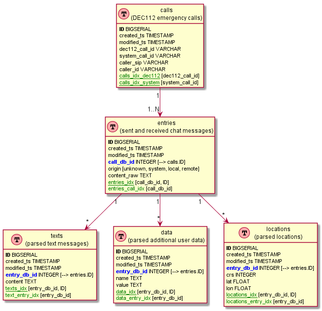

# DEC112 Border Gateway Database

The dec112 border gateway database records all components of a call.

|   Table   |               Description               |
| --------- | --------------------------------------- |
| calls     | Base call data                          |
| entries   | all chat message entries for a call     |
| texts     | Text part of an entry                   |
| locations | Geolocation part of an entry            |
| data      | Additional name/value data for an entry |

