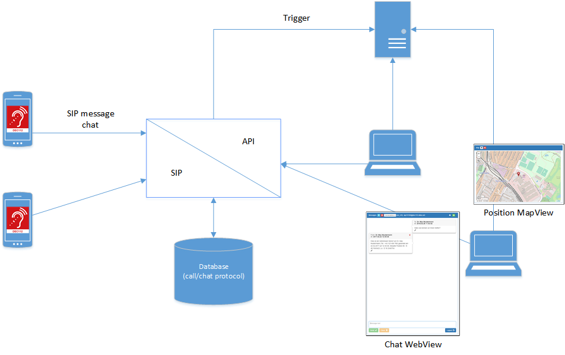

# DEC112 Border Gateway API documentation

The dec112 border gateway provides a separation between the SIP world and any other control center internal technologies.

This implementation provides a standard SIP interface on the ingres side and a REST and Websocket interface on its egres side.

REST and Websocket interfaces provide the same functionality to provide flexible integration into control center systems.

The Websocket interface also provides a publish/subscribe mechanism for notifying the control center systems about new calls and call messages.

Both APIs can be used simultaneously and use JSON as its message format.

All components of calls are stored in the gateways database

## Overview

* [Border Gateway Database](database.md)
* [Border Gateway API description](api.md)
* [API documentation (PDF version)](dec112-api-pdf)

---

***Note: Please always use the PDF version of the API documentation as it is more often updated as this page***

---

## Inbound SIP headers

The border also uses some special Call-Info headers to detect incomming DEC112 calls.
All inbound call missing one of these headers are rejected by the border gateway.

`Call-Info: <urn:dec112:uid:callid:(.*):service.dec112.at>; purpose=dec112-CallId`

The unique call_id as generated by the mobile app client. All messages with the same unique call_id belong to the same emergency call.

`Call-Info: <urn:dec112:uid:deviceid:(.*):service.dec112.at>; purpose=dec112-DeviceId`

The unique device_id as generated by the mobile app client. Used to uniquely identify the client device.

`Call-Info: <urn:dec112:uid:msgtype:(\d+):service.dec112.at>; purpose=dec112-MsgType`

The type of the received message numerically encoded as follows:

    XXX = bitfield (8 bit)

    7 6 5 4 3 2 1 0
    0 0 0 0 0 0 0 0
          | | | | |
          | | | +++
          | | |  |
          | | |  +----- 0 0 = unknown
          | | |         0 1 = start call message
          | | |         1 0 = message in call
          | | |         1 1 = end call message
          | | |
          | | +-------- 0 = no location
          | |           1 = location
          | |
          | +---------- 0 = no additional infos
          |             1 = additional infos included
          |
          +------------ 0 = no message text
                        1 = message text

    Bit 5-7 reserved (always 0)

`Call-Info: <urn:dec112:uid:language:(.*):service.dec112.at>;purpose=dec112-Language`

For automatic messages generated by the border element and for informing the call taker about the used language. Simple 2 char lowercase IOS language code e.g. de for german or en for english. Determined by the mobile app from mobile os settings.

## Outbound SIP headers

To indicate to the client that a call was ended by the border the border sends a message including a `MsgType` Call-Info header (as described in the inbound section above) with the first two LSB set.

Also every message from the border to the client includes a `Reply-To` header. The value of this header must be used by the client as SIP uri for further messages. This is used for call redirection purposes.

## Detecting DEC112 SIP messages

A SIP message is considered to be a valid DEC112 message when all of the following conditions are met. If they are not met the message is rejected writing information to the border gateway logfile and sending a SIP message back to caller indicating that the message could not be processed and caller must use another way to make its emergency call.

* first `Inbound SIP headers` are checked. If any of these headers are missing or is invalid then the message is rejected.

* check if message contains a `Content-Length` header. If header is found get its value and if not found assume a message length of 0.

* check message `Content-Type` header. If not found assume a `text/plain` mime type. Supported mime types are `text/plain` and `multipart/mixed` any other mime type will be rejected. `text/plain` messages are not further analyzed. `multipart/mixed` are parsed for further mime blocks.

* check msgtype `Call-Info` header flags against message content. If this does not match (e.g. flags indicate locations availlable but in received message none are present) reject message.

If message passes this checks it is further processed by border gateway (e.g. store in datebase etc.)
